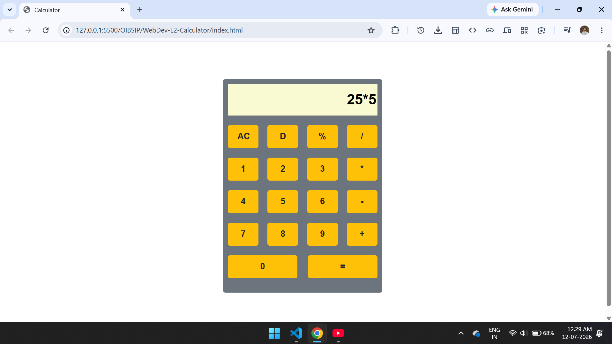

# Calculator App 
A simple calculator app, build using html css and js.

## 📌 Overview
This is a Simple Web Calculator built from scratch using standard frontend web technologies: HTML5, CSS3 (with Bootstrap 5), and Vanilla JavaScript.

## 📂 Project Architecture

The project consists of three core runtime files:

├── index.html   # Main layout structure utilizing Bootstrap design rules
├── style.css    # Typography, button surfaces, and color accents
└── app.js       # Main state routine & custom token evaluation engine

<h2>📷 Screenshot :</h2>

## 👤 Author

*   **Name:** Your Name
*   **Portfolio:** [https://dinakrushna7077.github.io/Dinakrushna-Portfolio/](https://dinakrushna7077.github.io/Dinakrushna-Portfolio/)
*   **GitHub:** [@Dinakrushna7077](https://github.com/Dinakrushna7077)
*   **LinkedIn:** [linkedin.com/in/dinakrushna7077](https://www.linkedin.com/in/dinakrushna7077/)

*Feel free to reach out if you have any questions about this project!*