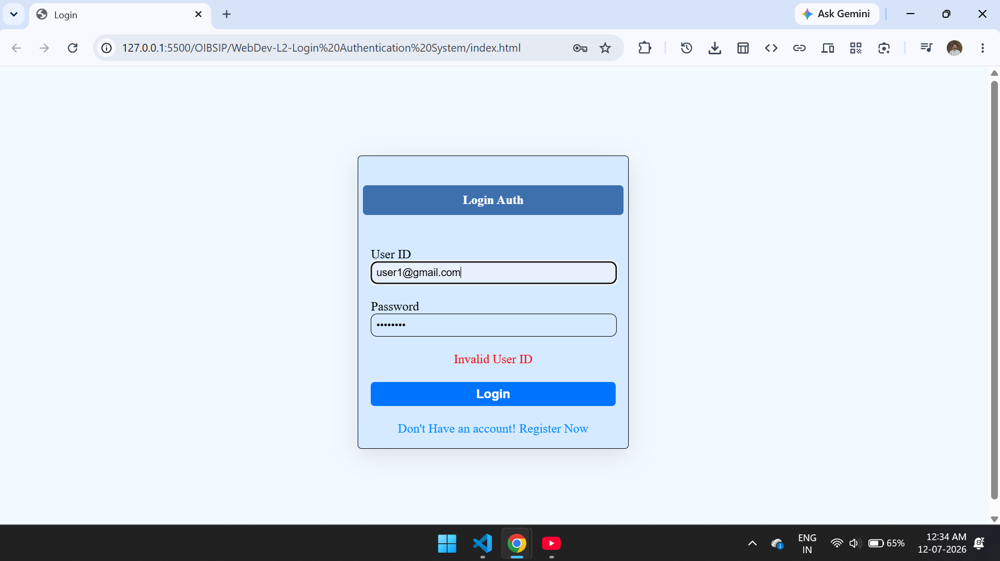
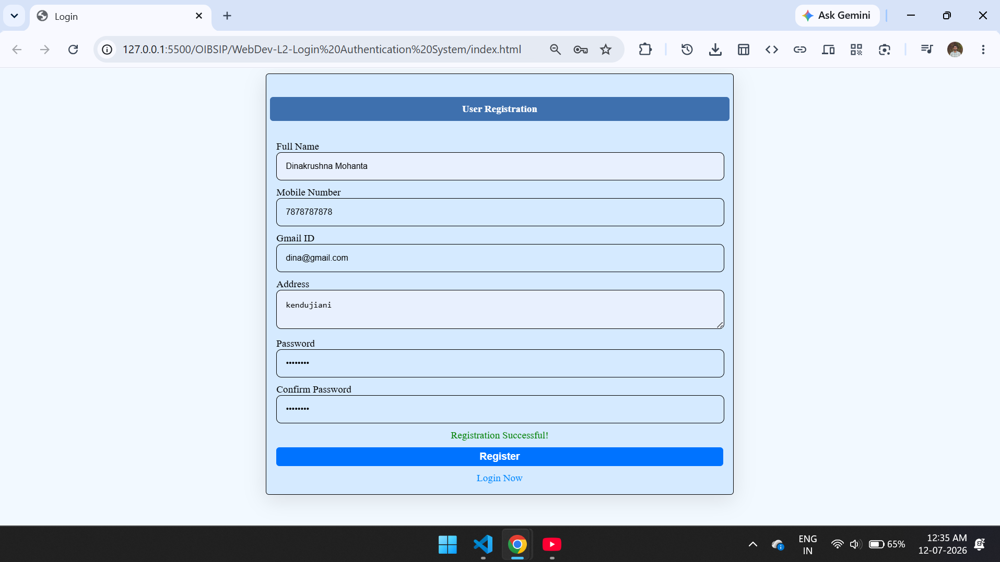
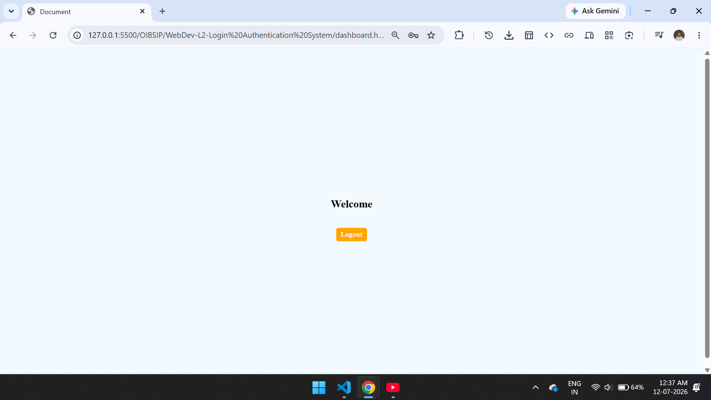

# Login Authentication System
Simple Authentication Interface (Login & Registration)

A clean, responsive, single-page authentication interface featuring seamlessly switchable Login and Registration forms. Built using semantic HTML5 and styled with modern utility classes.

## 🚀 Features

- **Dual-Form Toggle:** Instantly switches between Login and Registration views without reloading the page.
- **Responsive Layout:** Perfectly centered flexbox design that auto-adjusts across mobile, tablet, and desktop viewports.
- **Secure Architecture Hooks:** Includes built-in entry points for clientside validation and password hashing before submission.

## 🛠️ Tech Stack & Dependencies

- **HTML5:** Semantic markup structure.
- **CSS3 (style.css):** Custom styling sheet for inputs and brand colors.
- **jsSHA (v3.3.1):** Loaded via CDN (`sha256.min.js`) to enable secure, clientside SHA-256 password hashing.

## <h2>📷 Screenshot :</h2>
<label>Login and Register</label>

## 👤 Author

*   **Name:** Your Name
*   **Portfolio:** [https://dinakrushna7077.github.io/Dinakrushna-Portfolio/](https://dinakrushna7077.github.io/Dinakrushna-Portfolio/)
*   **GitHub:** [@Dinakrushna7077](https://github.com/Dinakrushna7077)
*   **LinkedIn:** [linkedin.com/in/dinakrushna7077](https://www.linkedin.com/in/dinakrushna7077/)

*Feel free to reach out if you have any questions about this project!*