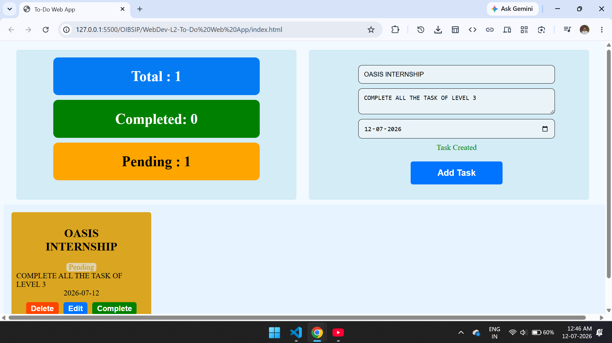
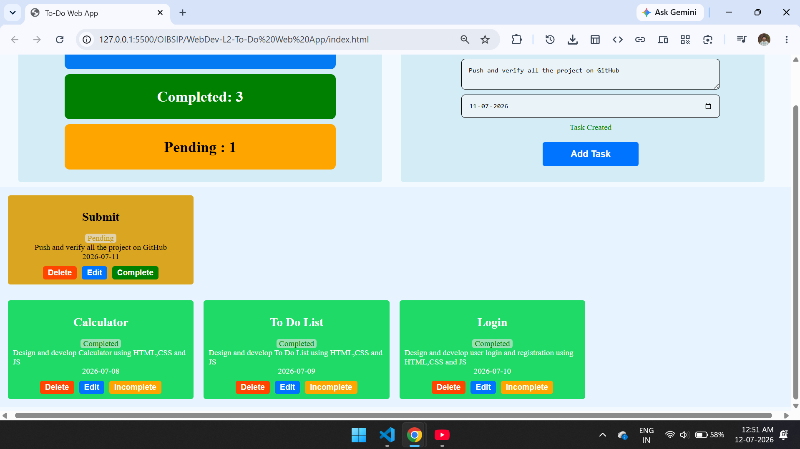

# To-Do-Web App
A clean, responsive task management dashboard that separates tasks into pending and completed lifecycles. Built with semantic HTML5 and utility-first layout classes for a fluid user experience.

## 🚀 Features

- **Split Dashboard:** Dual-pane layout splitting real-time metrics and task creation inputs.
- **Dynamic Metrics Tracker:** Visual hooks for total, completed, and pending task counts.
- **Unified Form State:** An intelligent input panel that handles both adding new tasks and modifying existing tasks using a contextual update mode.
- **Lifecycle Management:** Dedicated zones for organizing tasks based on their workflow status (Pending vs. Completed).

## 🛠️ Project Structure & Architecture

The application is modularized across three primary files:
- `index.html`: Defines the layout structure, input forms, and task card templates.
- `style.css`: Manages individual custom components (e.g., inputs, rounded cards, background variations).
- `app.js`: Governs state management, dynamic DOM rendering, and user interactions.

<h2>📷 Screenshot :</h2>

## 👤 Author

*   **Name:** Your Name
*   **Portfolio:** [https://dinakrushna7077.github.io/Dinakrushna-Portfolio/](https://dinakrushna7077.github.io/Dinakrushna-Portfolio/)
*   **GitHub:** [@Dinakrushna7077](https://github.com/Dinakrushna7077)
*   **LinkedIn:** [linkedin.com/in/dinakrushna7077](https://www.linkedin.com/in/dinakrushna7077/)

*Feel free to reach out if you have any questions about this project!*