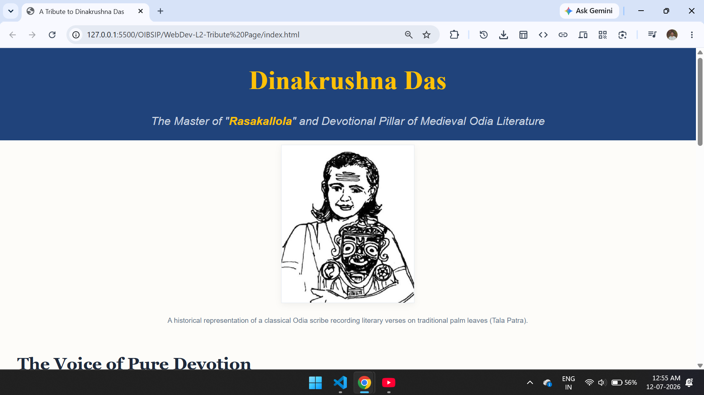
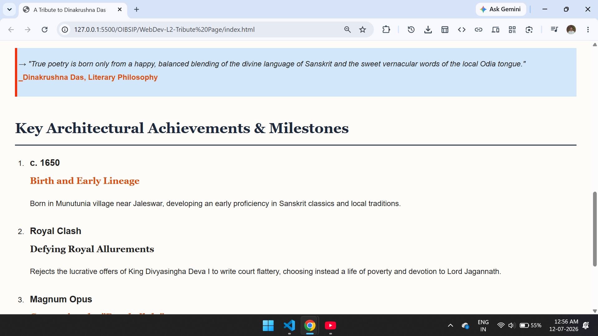

# Tribute Page: Dinakrushna Das

A visually engaging, responsive, and semantically structured tribute page dedicated to the legendary medieval Odia Bhakti poet and author, **Dinakrushna Das** (c. 1650–1710). 

This project was built to satisfy a fundamental web development frontend design challenge using clean, highly readable HTML5 and straightforward CSS3.

## 🛠️ Tech Stack

*   **HTML5:** Semantic architecture using structure tags like `<header>`, `<main>`, `<section>`, `<picture>/`, and `<footer>`.
*   **CSS3:** Standard, direct cascading style syntax engineered for large spacing, enhanced readability, and fluid element flow without bloated frameworks.

<h2>📷 Screenshot :</h2>

## 🚀 How to Run the Project Locally

Because the project is entirely self-contained within a single file, it requires no installation, build systems, or external dependencies.

1.  **Clone or Download:** Copy the code provided in the project window.
2.  **Create File:** Create a new file on your local machine and name it `index.html`.
3.  **Paste Code:** Paste the copied code into the file and save it.
4.  **Launch:** Double-click `index.html` to instantly view the polished webpage inside any modern desktop or mobile browser.

## 👤 Author

*   **Name:** Your Name
*   **Portfolio:** [https://dinakrushna7077.github.io/Dinakrushna-Portfolio/](https://dinakrushna7077.github.io/Dinakrushna-Portfolio/)
*   **GitHub:** [@Dinakrushna7077](https://github.com/Dinakrushna7077)
*   **LinkedIn:** [linkedin.com/in/dinakrushna7077](https://www.linkedin.com/in/dinakrushna7077/)

*Feel free to reach out if you have any questions about this project!*